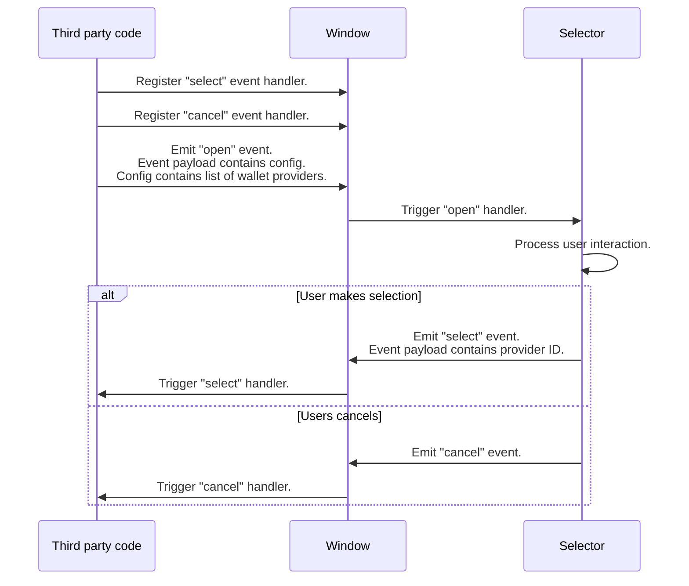

# Selector API

Interaction with the selector is done by means of custom events. The selector sets up event listeners when it mounts, and convenience methods are available to interact with the selector.

For convenience, all the events are emitted to and listened from `window`.

## Request flow

Below is how third party code would interact with the selector.

For convenience, the `selectWalletProvider()` method is provided to perform the flow above. It takes care of setting up the necessary event handlers, returns the result as a `Promise` and cleans up the event handlers when done.

## A note on Typescript

The event names used by the selector are defined in [`selector-events.ts`](../src/lib/selector-events.ts), which is necessary to satisfy the compiler.
