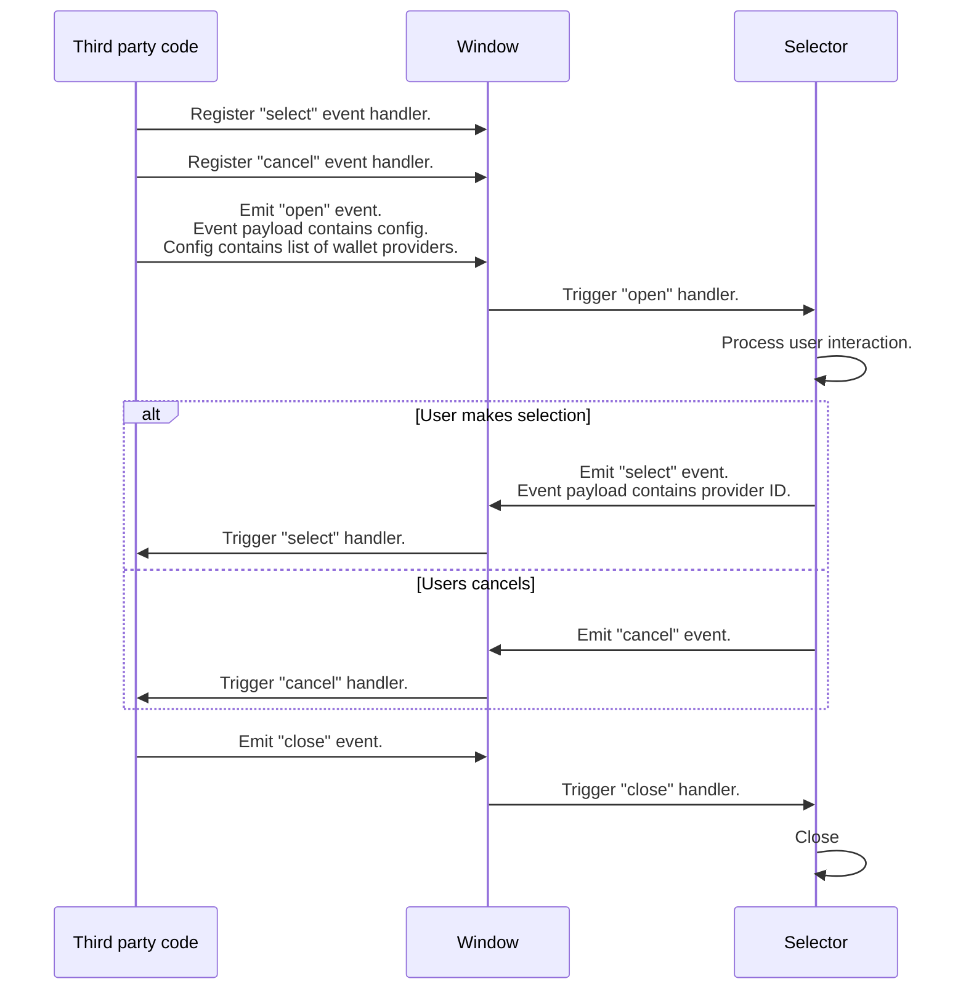

# Selector API

Interaction with the selector is done by means of custom events. The selector sets up event listeners when it mounts, and convenience methods are available to interact with the selector.

For consistency and practicality, all the events are emitted to and listened from `window`.

## Loading the selector

Before use, the selector needs to be registered as a custom element and inserted into the DOM. The `loadSelector()` helper function facilitates both these actions, ensuring the selector is properly registered and added to the page.

To remove the selector and all event listeners, use `cleanup()`.

## Events API

Events are used to interact with the selector.

### Listeners

- **open** `"sats-connect_wallet-provider-selector_open"`: The selector will open and display the providers as configured using custom event's `details` property, which is expected to be of type [`Config`](../src/lib/utils.ts)
- **close** `"sats-connect_wallet-provider-selector_close"`: The selector will close if open.
- **wallet open** `"sats-connect_wallet-provider-selector_walletOpen"`: The third party interacting with the selector may optionally notify the selector when the user has their wallet open or visible. The selector will display a message indicating that an operation is in progress.
- **wallet close** `"sats-connect_wallet-provider-selector_walletClose"`. The third party interacting with the selector may optionally notify when the user has closed their wallet or it is no longer visible. The selector will stop showing that an operation is in progress if it previously received a "wallet open" event.

### Emitted events

- **select**: `"sats-connect_wallet-provider-selector_select"`: Emitted when the user selects a provider. The selected provider ID is in the custom event's `details` property.
- **cancel** `"sats-connect_wallet-provider-selector_cancel"`: Emitted when the user closes the selector.

## Request flow

Below is how third party code would interact with the selector.

Note that the selector must be explicitly closed when the user makes a selection. This allows for the display of a "wallet open" message to the user by the app integrating the selector.

For convenience, the following methods are available to interact with the selector:

- `selectWalletProvider()`: Opens the selector and returns a promise with the user's selection, or rejects if the user closes the selector.
- `walletOpen()`: Informs the selector that the user's wallet is open. The selector will display a message to the user indicating that an operation is in progress.
- `walletClose()`: Informs the selector the user's wallet is closed.
- `close()`: Closes the selector.

## A note on Typescript

The event names used by the selector are defined in [`selector-events.ts`](../src/lib/selector-events.ts), which is necessary to satisfy the compiler.
